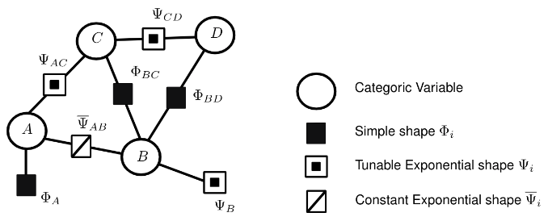

- [What is EFG](#intro)
- [Project structure](#contents)
- [Samples](#samples)
- [CMake support](#cmake-support)
- [Usage](#usage)
- [EFG GUI](#efg-gui)

## INTRO

**Easy Factor Graph**, aka **EFG**, is a general purpose c++ library for handling **undirected graphical models**, sometimes called also **factor graphs**.
**Undirected graphical models** are probabilistic models similar to **bayesian networks**, but offerring some nicer 
properties. Not familiar with this kind of concepts? Don't worry, have a look at the [documentation](https://github.com/andreacasalino/Easy-Factor-Graph/blob/master/doc/EFG.pdf) in the **doc** folder before diving into the code ;).
**Random Fields** as well as **Conditional Random Fields** are particular classes of **undirected graphical models** and can be easily created and **trained** using this library.

Rememebr to leave a **star** if you have found this repository useful.



Training can be done using the gradient-base approaches implemented of [this](https://github.com/andreacasalino/TrainingTools) external library.

In particular, **EFG** is able to:
 * dynamically build and update undirected factor graph, inserting one by one the factors that compose the model
 * dynamically set the group of evidences
 * perform belief propagation on both **loopy graph** and **polytree** like structure in order to
   * get the **marginal conditioned distribution** of an hidden variable w.r.t. the current evidence set
   * get the **maximum a posteriori** of an hidden variable (or for the entire hidden set in one single call) w.r.t. the current evidence set
 * import or export models from and to xml file
 * import or export models from and to json string (or file)
 * draw samples for the variables composing the model
 * train **random** and **conditional random fields** with gradient based approaches (**gradient descend**, **conjugate gradient descend**, **quasi newton method**, etc.)

With respect to similar libraries, **EFG** is also able to:
 * enforce the fact that group of tunable factors should have the same weight
 * exploits an internal thread pool in order to dramatically reduce the time required to:
   * perform belief propagation
   * train **random** and **conditional random fields**
   * draw samples for the variables involved in the model

## CONTENTS

Haven't yet left a **star**? Do it now! :).

This project is structured as follows:
 * the documentation in ./doc explains both how to use **EFG** as well give some theoretical background about **undirected graphical models**
 * the sources of the **EFG** library are contained in ./src
 * ./samples contains 8 classes of examples, extensively showing how to use **EFG**


## SAMPLES

Haven't yet left a **star**? Do it now! :).

The samples contained in the [samples](./samples) folder and extensively shows how to use **EFG**.
All of the samples consume a library of utilities called **Samples-Helpers**, which contain common functionalities like printing utilities, that are not part (and don't need to be) of **EFG**.

## CMAKE SUPPORT

Haven't yet left a **star**? Do it now! :).

To consume this library you can rely on [CMake](https://cmake.org).
More precisely, You can fetch this package and link to the **EFG** library:
```cmake
include(FetchContent)
FetchContent_Declare(
efg
GIT_REPOSITORY https://github.com/andreacasalino/Easy-Factor-Graph
GIT_TAG        master
)
FetchContent_MakeAvailable(efg)
```

and then link to the **EFG** library:
```cmake
target_link_libraries(${THE NAME OF THE TARGET NEEDING EFG}
   EFG-Core
)
```
### TRAINING CAPABILITIES

The possibility to train a model is enabled by deafult. However, such functionality rely on [this](https://github.com/andreacasalino/TrainingTools) external library, which might slow down the time required to set up the cmake project.
Therefore, if you don't need that you can set the CMake option **BUILD_EFG_TRAINER_TOOLS** equal to **OFF**.
However, after disabling that option you will still able to get the tunable weights of a model, as well as their gradient, allowing you to use or implement another gradient based trainer. 

The external package for performing training uses [**Eigen**](https://gitlab.com/libeigen/eigen) as internal linear algebra engine. 
**Eigen** is by default [fetched](https://cmake.org/cmake/help/latest/module/FetchContent.html) from the official gitlab repo by **CMake** and made available.
However, if you already have installed **Eigen** on your machine you can also decide to use that local version, by [setting](https://www.youtube.com/watch?v=LxHV-KNEG3k&t=1s) the **CMake** option **EIGEN_INSTALL_FOLDER** equal to the root folder storing the local **Eigen** you want to use.

### XML SUPPORT

By default, the features to export and import models from **XML** files are enabled. If you don't need them, put the CMake option **BUILD_EFG_XML_CONVERTER** to **OFF**.

### JSON SUPPORT

By default, the features to export and import models from **JSON** files are enabled. They rely on the famous [nlohmann](https://github.com/nlohmann/json) library, which is internally fetched and linked.
If you don't need such functionalities, put the CMake option **BUILD_EFG_JSON_CONVERTER** to **OFF**.

### VISUAL STUDIO COMPATIBILITY

This library exploits virtual inheritance to define some objects hierarchies. This might trigger [this](https://stackoverflow.com/questions/6864550/c-inheritance-via-dominance-warning) weird warning when compiling in Windows with Visual Studio. You can simply ignore it or tell Visual Studio to ignore warning code 4250, which is something that can be done as explained [here](https://docs.microsoft.com/en-us/cpp/error-messages/compiler-warnings/compiler-warning-level-3-c4996?view=msvc-170).
    

## USAGE

Haven't yet left a **star**? Do it now! :).

For convenience, assume all these namespaces are used by default:
```cpp
using namespace EFG;
using namespace EFG::categoric;
using namespace EFG::factor;
using namespace EFG::model;
using namespace EFG::io;
using namespace EFG::train;
using namespace EFG::strct;
```

### FACTORS CONSTRUCTION

**EFG** allows you to define categoric variables and factors by calling simple functions.
This is what you would do to build a couple of variables:
```cpp
    // define a couple of variables, with the same size
    VariablePtr A = make_variable(3, "A"); // size is 3
    VariablePtr B = make_variable(3, "B"); // size is 3
```

Such variables can be referred by the factors correlating them. In order to build a simple correlating factor this is what you would do:
```cpp
    // build a simply correlating factor connecting the 2 variables
    Factor factor_AB(VariablesSoup{B, A}, // the order in the specified
                                          // group matters: B is assumed
                                          // as the first variable, A
                                          // will be the second
                     Factor::SimplyCorrelatedTag{});
```

And this is what you would do to generate an exponential simple correlating factor:
```cpp
    // build an exponential factor using as base `factor_AB`: values of the
    // images are assumed as exp(weight * images_factor_AB)
    FactorExponential factor_AB_exponential(
        factor_AB,
        1.5f // this will be the value assumed for the weight
);
```

You can also define custom factors, specifying the shape function that maps the values in their domain with their images.
For example:
```cpp
    // define another variable
    VariablePtr C = make_variable(2, "C"); // size is 2
    // define a factor connecting C to B
    // we start building an empty factor, having all images equal to 0
    Factor factor_BC(VariablesSoup{B, C});
    // set some individual images of factor_BC
    // set for <0,1> -> 2
    factor_BC.set(std::vector<std::size_t>{0, 1}, 2.f);
    // set for <2,0> -> 1.3f
    factor_BC.set(std::vector<std::size_t>{2, 0}, 1.3f);
```

### MODELS CONSTRUCTION

Factor graphs can be built incrementally, passing one by one the factors that compose them.
Without loss of generality suppose to start from an empty **random field**:
```cpp
    // start building an empty random field
    RandomField model;
```

then, you can build some factors and enrich the model with them:
```cpp
    // define some variables, which will be later connected
    auto A = make_variable(4, "varA");
    auto B = make_variable(4, "varB");
    auto C = make_variable(4, "varC");

    // without loss of generality, add to the model some simply correlating
    // factors
    model.addConstFactor(std::make_shared<Factor>(
        VariablesSoup{A, B},
        Factor::SimplyCorrelatedTag{})); // the generated smart
                                         // pointer is shallow
                                         // copied
    model.copyConstFactor(
        Factor{VariablesSoup{A, C},
               Factor::SimplyCorrelatedTag{}}); // the passed factor is
                                                // deep-copied into the
                                                // model
```

The previously added factor are kept constant in the model. In order to enrich the model with a tunable factor you can call a different method:
```cpp
    // build some additional tunable exponential factors that will be too added
    auto factor_exp_BC = std::make_shared<FactorExponential>(
        Factor{VariablesSoup{B, C}, Factor::SimplyCorrelatedTag{}}, 1.f);
    model.addTunableFactor(factor_exp_BC);

    auto D = make_variable(4, "varD");
    auto factor_exp_CD = std::make_shared<FactorExponential>(
        Factor{VariablesSoup{C, D}, Factor::SimplyCorrelatedTag{}}, 1.5f);
    model.addTunableFactor(factor_exp_CD);
```

You can also add a tunable factor, that must share its weigth with an already inserted factor of the model:
```cpp
    // insert another tunable factor, this time specifying that it needs to
    // share the weight with already inserted exponential factor that connects B
    // and C
    model.addTunableFactor(
        std::make_shared<FactorExponential>(
            Factor{VariablesSoup{C, D}, Factor::SimplyCorrelatedTag{}},
            2.f // actually this value is irrelevant, as the weight of
                // factor_exp_BC will be assumed from now on
            ),
        VariablesSet{B, C}
        // this additional input is to specify that this exponential factor
        // needs to share the weight with the one connecting B and C
    );
```

You can also import the entire graph defined in an xml file:
```cpp
    // absorb the structure defined in an xml file
    xml::Importer::importFromFile(model, std::string{"file_name.xml"});
```
check the documentation or the samples for the expected format the xml file should be compliant with.

Similarly, you can also import the structure defined in a **json**
```cpp
    // absorb the structure encoded in a json string
    nlohmann::json json_defining_a_structure = ...;
    json::Importer::importFromJson(model, json_defining_a_structure);
```
check the documentation or the samples for the expected format the json should be compliant with.

### QUERY THE MODEL

A generated model can be queried in many ways.
However, any query that you can do, is conditioned to the latest set of evidences. 

Setting the evidences can be easily done by calling:
```cpp
    // set some evidences
    model.setEvidence("variable_1", 0); // setting variable_1 = 0
    model.setEvidence("variable_2", 2); // setting variable_2 = 2
```

You can get the **conditioned marginal distribution** of a variable by calling:
```cpp
    // get the marginal conditioned distribution of an hidden variable
    std::vector<float> conditioned_marginals =
        model.getMarginalDistribution("var_A");
```

Or you might be interested in the **maximum a posteriori estimation** of the entire evidence set:
```cpp
    // get maxiomum a posteriori estimation of the entire hidden set
    std::vector<std::size_t> MAP_hidden_set = model.getHiddenSetMAP();
```

As already mentioned, results are subjected to the latest evidences set (which can be also empty).
Of course, you can update the evidences and get the updated marginals:
```cpp
    // set some new evidences
    model.removeAllEvidences();
    model.setEvidence("evid_1", 1);

    // compute new conditioned marginals: the should be different as the
    // evidences were changed
    conditioned_marginals = model.getMarginalDistribution("var_A");
```

### TUNE THE MODEL

Tunable models are characterized by the exponential factors added to the model itself. Such kind of modelscan be **trained**.
This is done by relying on a training set, which can be for example imported from a file:
```cpp
    // assume we have a training set for the model stored in a file
    TrainSet training_set = import_train_set("file_name.txt");
```

Then, a training approach must be chosen. You can rely on one of the ready to use approaches implemented in [this](https://github.com/andreacasalino/TrainingTools) (by default) fetched package. 
Suppose you want to use a quasi Newton method:
```cpp
    // we can train the model using one of the ready to use gradient based
    // approaches
    ::train::QuasiNewton ready_to_use_trainer;
    ready_to_use_trainer.setMaxIterations(50);
```

Then, you are ready to train the model:
```cpp
    // some definitions to control the training process
    TrainInfo info = TrainInfo{
        4,  // threads to use
        1.f // stochasticity. When set different from 1, the stochastich
            // gradient descend approaches are actually used
    };

    train_model(tunable_model, ready_to_use_trainer, training_set, info);
```

### GIBBS SAMPLING

Sometimes, it might be useful to draw samples from the model. This can be done with the Gibbs sampling strategy provided by **EFG**:
```cpp
    // some definitions to control the samples generation process
    GibbsSampler::SamplesGenerationContext info =
        GibbsSampler::SamplesGenerationContext{
            1000, // samples number
            0,    // seed used by random engines
            500   // number of iterations to discard at the beginning (burn out)
        };

    // get samples from the model using Gibbs sampler
    std::vector<std::vector<std::size_t>> samples =
        model.makeSamples(info,
                          4 // threads to use
        );
```

## EFG GUI

If you have found this library useful, please find the time to leave a star :). Just before you go, be aware that [Easy-Factor-Graph-GUI](https://github.com/andreacasalino/Easy-Factor-Graph-GUI) wraps this library as C++ backend to a nice graphical user interactive application:


