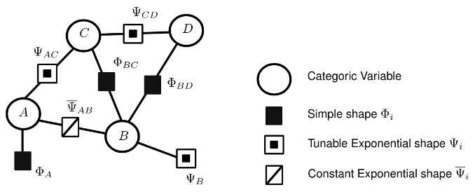

- [What is EFG](#intro)
- [Project structure](#contents)
- [Samples](#samples)
- [Python](#python)
- [CMake support](#cmake-support)
- [Usage](#usage)

## INTRO

**Easy Factor Graph**, aka **EFG**, is a general purpose c++ library for handling **undirected graphical models**, sometimes called also **factor graphs**.
**Undirected graphical models** are probabilistic models similar to **bayesian networks**, but offerring some nicer 
properties. Not familiar with this kind of concepts? Don't worry, have a look at the [documentation](https://github.com/andreacasalino/Easy-Factor-Graph/blob/master/doc/EFG.pdf) in the **doc** folder before diving into the code ;).
**Random Fields** as well as **Conditional Random Fields** are particular classes of **undirected graphical models** and can be easily created and **trained** using this library.

Rememebr to leave a **star** if you have found this repository useful.



Training can be done using the gradient-base approaches implemented of [this](https://github.com/andreacasalino/TrainingTools) external library.

In particular, **EFG** is able to:
 * dynamically build and update undirected factor graph, inserting one by one the factors that compose the model
 * dynamically set the group of evidences
 * perform belief propagation on both **loopy graph** and **polytree** like structure in order to
   * get the **marginal conditioned distribution** of an hidden variable w.r.t. the current evidence set
   * get the **maximum a posteriori** of an hidden variable (or for the entire hidden set in one single call) w.r.t. the current evidence set
 * import or export models from and to xml file
 * import or export models from and to json string (or file)
 * draw samples for the variables composing the model
 * train **random** and **conditional random fields** with gradient based approaches (**gradient descend**, **conjugate gradient descend**, **quasi newton method**, etc.)

With respect to similar libraries, **EFG** is also able to:
 * enforce the fact that group of tunable factors should have the same weight
 * exploits an internal thread pool in order to dramatically reduce the time required to:
   * perform belief propagation
   * train **random** and **conditional random fields**
   * draw samples for the variables involved in the model
 * **python** bindings of this library are offered by [this repo](https://github.com/andreacasalino/Easy-Factor-Graph-py), which is actually a [**python** package](https://pypi.org/project/efg/) that can be **pip** installed.

## CONTENTS

Haven't yet left a **star**? Do it now! :).

This project is structured as follows:
 * the documentation in ./doc explains both how to use **EFG** as well give some theoretical background about **undirected graphical models**
 * the sources of the **EFG** library are contained in ./src
 * ./samples contains 8 classes of examples, extensively showing how to use **EFG**


## SAMPLES

Haven't yet left a **star**? Do it now! :).

The samples contained in the [samples](./samples) folder and extensively shows how to use **EFG**.
All of the samples consume a library of utilities called **Samples-Helpers**, which contain common functionalities like printing utilities, that are not part (and don't need to be) of **EFG**.

## PYTHON

Wait a minute ... **Easy Factor Graph** is great, but I don't know **C++** and I am more used to **python** ... well [this package](https://pypi.org/project/efg/) is a **pip** installable wrapper of **EFG** created with [pybind](https://github.com/pybind/pybind11). Combine the power of **EFG** and **python** in your next project!

## CMAKE SUPPORT

Haven't yet left a **star**? Do it now! :).

To consume this library you can rely on [CMake](https://cmake.org).
More precisely, You can fetch this package and link to the **EFG** library:
```cmake
include(FetchContent)
FetchContent_Declare(
efg
GIT_REPOSITORY https://github.com/andreacasalino/Easy-Factor-Graph
GIT_TAG        master
)
FetchContent_MakeAvailable(efg)
```

and then link to the **EFG** library:
```cmake
target_link_libraries(${THE NAME OF THE TARGET NEEDING EFG}
   EFG-Core
)
```
### TRAINING CAPABILITIES

The possibility to train a model is enabled by deafult. However, such functionality rely on [this](https://github.com/andreacasalino/TrainingTools) external library, which might slow down the time required to set up the cmake project.
Therefore, if you don't need that you can set the CMake option **BUILD_EFG_TRAINER_TOOLS** equal to **OFF**.
However, after disabling that option you will still able to get the tunable weights of a model, as well as their gradient, allowing you to use or implement another gradient based trainer. 

The external package for performing training uses [**Eigen**](https://gitlab.com/libeigen/eigen) as internal linear algebra engine. 
**Eigen** is by default [fetched](https://cmake.org/cmake/help/latest/module/FetchContent.html) from the official gitlab repo by **CMake** and made available.
However, if you already have installed **Eigen** on your machine you can also decide to use that local version, by [setting](https://www.youtube.com/watch?v=LxHV-KNEG3k&t=1s) the **CMake** option **EIGEN_INSTALL_FOLDER** equal to the root folder storing the local **Eigen** you want to use.

### XML SUPPORT

By default, the features to export and import models from **XML** files are enabled. If you don't need them, put the CMake option **BUILD_EFG_XML_CONVERTER** to **OFF**.

### JSON SUPPORT

By default, the features to export and import models from **JSON** files are enabled. They rely on the famous [nlohmann](https://github.com/nlohmann/json) library, which is internally fetched and linked.
If you don't need such functionalities, put the CMake option **BUILD_EFG_JSON_CONVERTER** to **OFF**.

### VISUAL STUDIO COMPATIBILITY

This library exploits virtual inheritance to define some objects hierarchies. This might trigger [this](https://stackoverflow.com/questions/6864550/c-inheritance-via-dominance-warning) weird warning when compiling in Windows with Visual Studio. You can simply ignore it or tell Visual Studio to ignore warning code 4250, which is something that can be done as explained [here](https://docs.microsoft.com/en-us/cpp/error-messages/compiler-warnings/compiler-warning-level-3-c4996?view=msvc-170).
    

## USAGE

Haven't yet left a **star**? Do it now! :).

### FACTORS CONSTRUCTION

**EFG** allows you to define factors as pure shape functions. This is what you would do to build a simple exponential correlating factor:
```cpp
    // Factors are just shape functions.
    // For examample this is an exponential simply correlating factor connecting
    // 2 variables each with space size equal to 3
    float weight = 1.5f;
    EFG::factor::FactorExponential<2> factor_exp =
        EFG::factor::make_exp_simply_correlated<2>(3, weight);
```

You can also define custom factors, specifying the shape function that maps the values in their domain with their images.
For example:
```cpp
    // This other factor is instead built defining value by value the element in
    // its domain
    //
    // This factor will connet 2 variables:
    // - the first having a space size of 3
    // - the second having a space size of 2
    //
    // domain is us:
    // - set for <0,1> -> 2
    // - set for <2,0> -> 1.3f
    EFG::factor::Factor<2> factor =
        EFG::factor::Factor<2>::fromSparseDomain<true>(
            EFG::categoric::Combination<2>{3, 2},
            {{{0, 1}, 2.f}, {{2, 0}, 1.3f}});
```

### MODELS CONSTRUCTION

Model can be built incrementally, defining one by one the variables and factors the model should contain.
The builder pattern is followed, for example this is what you would do to build a **random field**:
```cpp
    // builder pattern to define the pieces of the model
    EFG::structure::ModelBuilder builder;

    // define some variables, which will be later connected
    EFG::categoric::VarStateSize space_size{4};
    auto varA_idx = builder.make_variable(space_size);
    auto varB_idx = builder.make_variable(space_size);
    auto varC_idx = builder.make_variable(space_size);
    auto varD_idx = builder.make_variable(space_size);

    // add constant factors
    builder.add_binary_factor(
        EFG::factor::make_exp_simply_correlated<2>(space_size, 1.2f), varA_idx,
        varB_idx);

    // add additional tunable factors
    builder.add_binary_factor(
        EFG::factor::make_exp_simply_correlated<2>(space_size, 0.7f), varB_idx,
        varC_idx);
    builder.add_binary_factor(
        EFG::factor::make_exp_simply_correlated<2>(space_size, 1.5f), varC_idx,
        varD_idx);

    // now seal the model and actually build it
    EFG::model::RandomField model{
        EFG::structure::ModelBuilder::build(std::move(builder))};
```

Once created, the entire model can be queried (see below) or exported to file:
```cpp
    // export the model to a file
    std::filesystem::path dest_file = "/tmp/the_mdoel.json";
    model.to_file(dest_file);
```

### QUERY THE MODEL

A generated model can be queried in many ways.
However, any query that you can do, is conditioned to the latest set of evidences. 

Setting the evidences can be easily done by calling:
```cpp
    // set some evidences
    auto varA_idx = model.getStructure().named_vars_table.at("varA");
    auto varB_idx = model.getStructure().named_vars_table.at("varB");
    EFG::structure::Evidence ev_A{varA_idx, 1}; // prescribe setting varA = 1
    EFG::structure::Evidence ev_B{varB_idx, 0}; // prescribe setting varB = 0
    model.setEvidences(ev_A, ev_B);
```

You can get the **conditioned marginal distribution** of a variable by calling:
```cpp
    // get the marginal conditioned distribution of an hidden variable
    std::vector<float> conditioned_marginals;
    auto varC_idx = model.getStructure().named_vars_table.at(
        "varC"); // there is no need to look up every time the variable if you
                 // already know the index
    model.getMarginalDistribution(conditioned_marginals, varC_idx);
```

Or you might be interested in the **maximum a posteriori estimation** of the entire evidence set:
```cpp
    // get maxiomum a posteriori estimation of the entire hidden set
    std::vector<EFG::categoric::VarStateSize> MAP_hidden_set;
    model.getHiddenSetMAP(
        MAP_hidden_set); // same order of variable accessible through
                         // model.getStructure().nodes, keeping only hidden ones
                         // actually, is assumed
```

As already mentioned, results are subjected to the latest evidences set (which can be also empty).
Of course, you can update the evidences and get the updated marginals:
```cpp
    // set some new evidences
    model.removeAllEvidences();
    model.setEvidences(EFG::structure::Evidence{
        model.getStructure().named_vars_table.at("varE"), 1});

    // compute new conditioned marginals: the should be different as the
    // evidences were changed
    model.getMarginalDistribution(conditioned_marginals, varA_idx);
```

### TUNE THE MODEL

Tunable models are characterized by the exponential factors added to the model itself. Such kind of modelscan be **trained**.
This is done by relying on a training set, which can be for example imported from a file:
```cpp
    // assume we have a training set for the model stored in a file
    auto training_set = std::make_shared<EFG::misc::Samples>(
        EFG::structure::load_train_set("/tmp/the_training_set", 500));
```

The above traning set can be used to actually train a model. You can rely on the very simple gradient descend approach contained in this library, or use one of the ready to use approaches implemented in [this](https://github.com/andreacasalino/TrainingTools) or other ones: what this library gives you actually is the possibility to get/set the weights of the model as well as evaluate their gradient w.r.t. a given training set. Once you have this you can implement any traning startegy!
```cpp
    EFG::structure::ModelBuilder builder;
    EFG::model::ConditionalRandomField tunable_model{
        EFG::structure::from_file("/tmp/the_model.json")};

    // We can train the model using the function provided by this library, which
    // is a simple gradient descend
    //
    // At the same what this library offers is the possibility to get/set the
    // weights of the model as well as evaluate their gradient w.r.t. a given
    // training set. Once you have this you can implement any traning startegy!
    EFG::structure::Trainer{}
        .max_iterations(500)
        .gradient_rescale(0.02f)
        .train_model(tunable_model, training_set);
```

### GIBBS SAMPLING

Sometimes, it might be useful to draw samples from the model. This can be done with the Gibbs sampling strategy provided by **EFG**:
```cpp
    EFG::model::RandomField model{
        EFG::structure::from_file("/tmp/the_model.json")};

    // some definitions to control the samples generation process
    EFG::structure::GibbsSampler::SamplesGenerationContext samples_gen_context{
        .samples_number = 1000, // samples number
        .seed = 0,              // seed used by random engines
    };

    // get samples from the model using Gibbs sampler
    EFG::misc::Samples samples = model.makeSamples(samples_gen_context);
```
