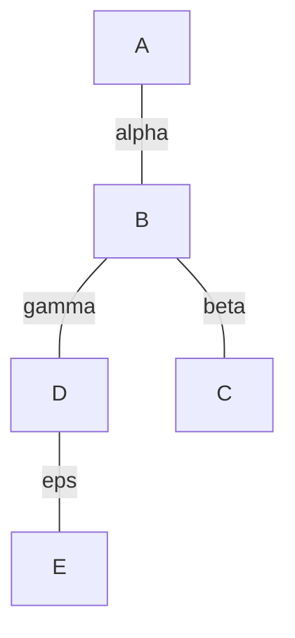
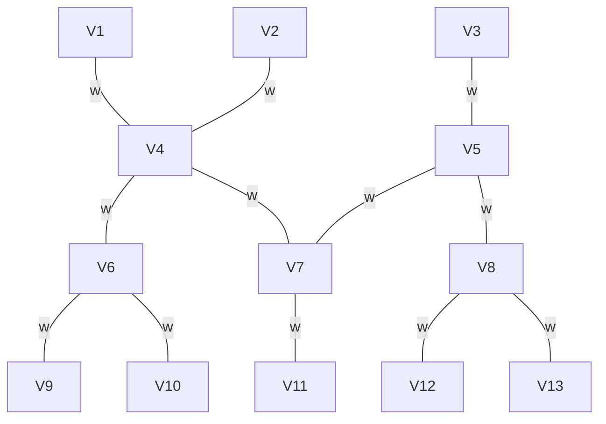
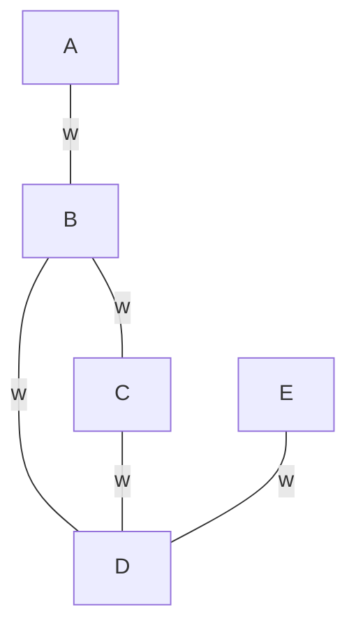
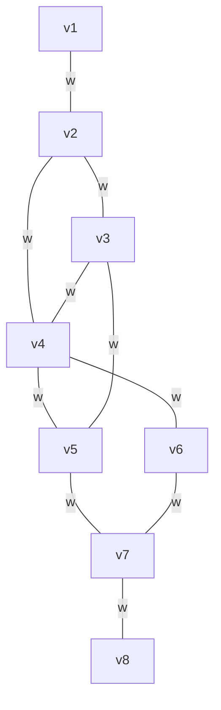

## Model library

SimpleTree:

```mermaid
graph
    A[A] ---|alpha| B[B]
    B[B] ---|gamma| D[D]
    B[B] ---|beta| C[C]
    D[D] ---|eps| E[E]
```

ComplexTree

```mermaid
graph
    V1[V1] ---|w| V4[V4]
    V2[V2] ---|w| V4[V4]
    V3[V3] ---|w| V5[V5]
    V4[V4] ---|w| V6[V6]
    V4[V4] ---|w| V7[V7]
    V5[V5] ---|w| V7[V7]
    V5[V5] ---|w| V8[V8]
    V6[V6] ---|w| V9[V9]
    V6[V6] ---|w| V10[V10]
    V7[V7] ---|w| V11[V11]
    V8[V8] ---|w| V12[V12]
    V8[V8] ---|w| V13[V13]
```

SimpleLoopy:

```mermaid
graph
    A[A] ---|w| B[B]
    B[B] ---|w| C[C]
    B[B] ---|w| D[D]
    C[C] ---|w| D[D]
    E[E] ---|w| D[D]
```

ComplexLoopy:

```mermaid
graph
    v1[v1] ---|w| v2[v2]
    v2[v2] ---|w| v4[v4]
    v2[v2] ---|w| v3[v3]
    v3[v3] ---|w| v4[v4]
    v4[v4] ---|w| v5[v5]
    v3[v3] ---|w| v5[v5]
    v4[v4] ---|w| v6[v6]
    v5[v5] ---|w| v7[v7]
    v6[v6] ---|w| v7[v7]
    v7[v7] ---|w| v8[v8]
```
